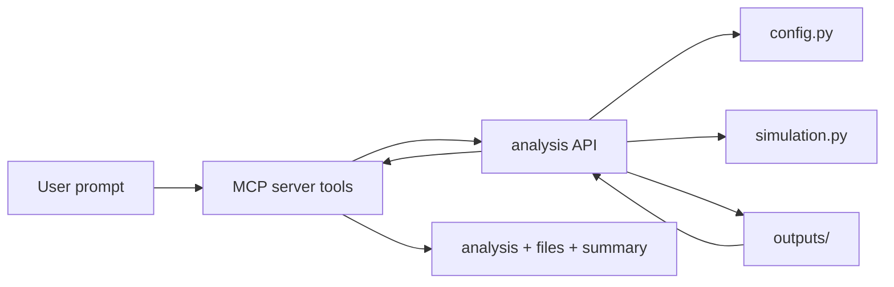

# MCP サーバー化手順

このファイルは、この BdG ブラックホール/ホワイトホール格子シミュレーションを MCP サーバーとして使えるようにするための実装手順です。

目標は、次のような自然言語の依頼に対して、適切な計算、診断、比較、要約を返せる状態です。

- 「サイト数を増やした時の停滞時間の変化が知りたい」
- 「`H_m` が変だから、計算式かコーディングミスがないか調べて」
- 「surface gravity fit が理論値と合わない理由を調べて」
- 「この run と前回 run の違いを説明して」

## 全体方針

MCP サーバーから直接 `simulation.py` のグローバル状態を触るより、先に解析 API 層を作り、その API を MCP tool から呼ぶ構成にします。



推奨するファイル構成です。

```text
Simulating_Black_Holes/
  main.py
  config.py
  simulation.py
  analysis_tools.py
  mcp_server.py
  docs/
    simulation_context_format.md
    mcp_server_plan.md
  tests/
    test_numerical_sanity.py
    test_analysis_tools.py
```

## Phase 1: 解析 API を作る

まず MCP とは独立に、Python から呼べる関数群を作ります。

### 1. `analysis_tools.py` を追加する

役割は、設定の準備、派生量の計算、既存 run の読み込み、簡単な診断、掃引実行です。

最初に用意したい関数です。

```python
def prepare_run_config(overrides: dict | None = None) -> dict:
    """DEFAULT_CONFIG と overrides を merge し、prepare_config 済み config を返す。"""

def describe_config(config: dict) -> dict:
    """epsilon, dt/epsilon, horizon, kappa, sigma physical などの派生量を返す。"""

def load_run_summary(run_dir: str) -> dict:
    """outputs/<run_name>/summary.json と config.json を読み込んで返す。"""

def list_runs(output_base_dir: str = "outputs") -> list[dict]:
    """run ディレクトリを新しい順に列挙し、主要 summary を返す。"""

def diagnose_static_config(config: dict) -> dict:
    """BdG Hermiticity、固有値ペア、局所演算子 Hermiticity など、短時間で可能な静的診断を返す。"""

def diagnose_run_outputs(run_dir: str) -> dict:
    """CSV/TXT/summary から NaN、inf、虚部、極端値、境界付近の異常を調べる。"""

def run_with_overrides(overrides: dict, *, quiet: bool = True) -> dict:
    """一時 config で simulation を実行し、run_dir と summary を返す。"""

def sweep_parameter(base_overrides: dict, parameter: str, values: list) -> dict:
    """parameter を掃引し、各 run の summary と比較表を返す。"""
```

### 2. グローバル状態を避ける実行関数を作る

現状の `simulation.configure(...)` と `run_simulation()` はグローバル変数を使います。
MCP から複数回呼ぶなら、少なくとも次のラッパーを用意します。

```python
def run_prepared_config(config: dict) -> dict:
    configure(config, DENSITY_PLOT_CONFIGS, ANIMATION_CONFIGS)
    run_simulation()
    return load_run_summary(config["output_dir"])
```

将来的には `simulation.py` 自体を、`run_simulation(params, output_config)` のような明示引数型に寄せるとさらに安全です。
ただし最初の MCP 化では、ラッパーで十分です。

### 3. run 名を MCP 向けに固定できるようにする

自然言語からの実験では、run を追跡しやすい名前にします。

例:

```json
{
  "run_name": "mcp_sweep_L300_surface_width_1",
  "outputs": {
    "heatmaps": false,
    "gifs": false,
    "mode_functions": false,
    "geodesic": false,
    "surface_gravity_fit": true,
    "fft": false
  }
}
```

重い GIF や mode function は、通常の診断 tool では既定 off にするのがおすすめです。

## Phase 2: 診断項目を増やす

「計算・コーディングミスしてないか」に答えるには、異常検知を定型化します。

### 静的診断

設定と行列だけで調べられる項目です。

- `H_BdG` が Hermitian か
- 固有値が `+E/-E` ペアになっているか
- 粒子正孔対称性を enforce した後の対応が崩れていないか
- `H_p`, `H_m`, `H_pm` の local operator が Hermitian か
- 開境界の端点処理が意図通りゼロになっているか
- horizon が存在するか
- chirality に対して選ばれる horizon が `beta = -1` または `beta = +1` と合っているか

返却例:

```json
{
  "status": "pass",
  "checks": {
    "bdg_hermitian": {"status": "pass", "max_error": 2.1e-16},
    "eigenvalue_pairing": {"status": "pass", "max_pair_error": 4.4e-12},
    "energy_density_hermitian": {"status": "pass"},
    "horizon_exists": {"status": "pass", "positions_j": [150.0]},
    "selected_horizon": {"status": "pass", "j": 150.0, "target_beta": 1.0}
  }
}
```

### 出力診断

実行済み run の CSV/TXT から調べる項目です。

- `summary.json` が存在するか
- `config.json` が保存されているか
- `H_p_val.csv`, `H_m_val.csv` に NaN/inf がないか
- `H_m_sigmas.txt` の符号、最小値、最大値、急なジャンプ
- `x_ave.txt` が単調に進んでいるか、境界に近づきすぎていないか
- 最大振幅の site/time が端点や horizon とどう関係するか
- FFT スペクトルの最大 mode が時間とともに不自然に飛んでいないか

返却例:

```json
{
  "status": "warning",
  "run_dir": "outputs/20260513_013600_BH_chi_minus_L300",
  "findings": [
    {
      "severity": "warning",
      "observable": "H_m",
      "message": "最大振幅が j=1 付近にあり、開境界端点の近傍です。境界効果の可能性があります。"
    },
    {
      "severity": "info",
      "observable": "H_m_sigmas",
      "message": "sigma の指数 fit は全時刻ではなく horizon 近傍通過中に制限する方がよいです。"
    }
  ]
}
```

## Phase 3: MCP tool を設計する

最初の tool set は小さく始めます。

### Tool 1: `inspect_config`

目的: config override を受け取り、実行せずに派生量を返す。

入力:

```json
{
  "overrides": {
    "L": 300,
    "scenario": "BH_chi_minus",
    "surface_gravity_beta": true,
    "surface_gravity_beta_width": 1
  }
}
```

出力:

```json
{
  "config": {
    "L": 300,
    "epsilon": 0.020943951023931952,
    "dt": 0.01,
    "scenario": "BH_chi_minus",
    "chirality": "chi_minus",
    "beta_sign": "plus"
  },
  "derived": {
    "dt_over_epsilon": 0.477464829275686,
    "sigma_physical": 0.01884955592153876,
    "horizon_positions_j": [150.0],
    "horizon_positions_x": [3.141592653589793],
    "surface_gravity_kappa": 1.0
  },
  "override_notes": [
    {
      "key": "chirality",
      "reason": "scenario=BH_chi_minus が chirality を決めるため"
    }
  ]
}
```

### Tool 2: `run_simulation`

目的: override 付きで 1 回実行し、summary と主要ファイルを返す。

入力:

```json
{
  "overrides": {
    "L": 100,
    "run_name": "mcp_test_L100",
    "outputs": {
      "heatmaps": false,
      "gifs": false,
      "mode_functions": false,
      "geodesic": false,
      "surface_gravity_fit": true,
      "fft": false
    }
  }
}
```

出力:

```json
{
  "run_dir": "outputs/mcp_test_L100",
  "summary": {
    "H_p_sigma_min_time": 1.23,
    "H_p_sigma_min": -0.01,
    "stagnation_time": 0.42
  },
  "files": {
    "summary": "outputs/mcp_test_L100/summary.json",
    "config": "outputs/mcp_test_L100/config.json",
    "H_m_sigmas": "outputs/mcp_test_L100/H_m_sigmas.txt",
    "x_ave": "outputs/mcp_test_L100/x_ave.txt"
  }
}
```

### Tool 3: `sweep_parameter`

目的: `L` や `surface_gravity_beta_width` などを掃引して比較する。

入力:

```json
{
  "parameter": "L",
  "values": [100, 200, 300],
  "base_overrides": {
    "scenario": "BH_chi_minus",
    "surface_gravity_beta": true,
    "surface_gravity_beta_width": 1,
    "outputs": {
      "heatmaps": false,
      "gifs": false,
      "mode_functions": false,
      "geodesic": false,
      "surface_gravity_fit": false,
      "fft": false
    }
  }
}
```

出力:

```json
{
  "parameter": "L",
  "rows": [
    {
      "L": 100,
      "run_dir": "outputs/mcp_sweep_L100",
      "epsilon": 0.06283185307179587,
      "dt_over_epsilon": 0.477464829275686,
      "H_p_sigma_min_time": 1.2,
      "stagnation_time": 0.4
    },
    {
      "L": 200,
      "run_dir": "outputs/mcp_sweep_L200",
      "epsilon": 0.031415926535897934,
      "dt_over_epsilon": 0.477464829275686,
      "H_p_sigma_min_time": 1.25,
      "stagnation_time": 0.43
    }
  ],
  "analysis": "dt/epsilon と sigma_physical は固定されています。残る L 依存は有限サイズ効果または observable の最小値検出条件を確認してください。"
}
```

### Tool 4: `diagnose_run`

目的: 既存 run に対して異常検知を行う。

入力:

```json
{
  "run_dir": "outputs/20260513_013600_BH_chi_minus_L300",
  "focus": "H_m"
}
```

出力:

```json
{
  "status": "warning",
  "findings": [
    {
      "severity": "info",
      "message": "H_m は真空差し引き後なので負値は直ちに異常ではありません。"
    },
    {
      "severity": "warning",
      "message": "最大振幅が端点近傍にあります。開境界の境界効果を確認してください。"
    }
  ],
  "next_checks": [
    "max(abs(imag(H_m))) を出す",
    "H_m の最大値位置を horizon 位置と比較する",
    "真空差し引き前後の値を比較する"
  ]
}
```

### Tool 5: `compare_runs`

目的: 複数 run の違いを説明する。

入力:

```json
{
  "run_dirs": [
    "outputs/mcp_sweep_L100",
    "outputs/mcp_sweep_L200",
    "outputs/mcp_sweep_L300"
  ],
  "metrics": [
    "H_p_sigma_min_time",
    "H_m_sigma_min_time",
    "stagnation_time",
    "surface_gravity_kappa"
  ]
}
```

出力:

```json
{
  "table": [
    {
      "run": "mcp_sweep_L100",
      "L": 100,
      "epsilon": 0.06283185307179587,
      "H_p_sigma_min_time": 1.2,
      "stagnation_time": 0.4
    }
  ],
  "analysis": "L に対して dt/epsilon は固定されています。stagnation_time の残差を見るには x_ave が指定位置を超える時刻と H_p sigma 最小時刻を別々に比較してください。"
}
```

## Phase 4: MCP サーバーを実装する

Python で実装する場合の最小構成です。

### 1. 依存を追加する

`requirements.txt` に MCP SDK を追加します。

```text
mcp
```

ネットワーク制限がある環境では、依存追加と install はユーザー承認が必要になることがあります。

### 2. `mcp_server.py` を作る

概念的には次のような形です。

```python
from mcp.server.fastmcp import FastMCP

from analysis_tools import (
    compare_runs,
    describe_config,
    diagnose_run_outputs,
    list_runs,
    prepare_run_config,
    run_with_overrides,
    sweep_parameter,
)

mcp = FastMCP("simulating-black-holes")


@mcp.tool()
def inspect_config(overrides: dict | None = None) -> dict:
    config = prepare_run_config(overrides or {})
    return describe_config(config)


@mcp.tool()
def run_simulation(overrides: dict) -> dict:
    return run_with_overrides(overrides)


@mcp.tool()
def sweep(parameter: str, values: list, base_overrides: dict | None = None) -> dict:
    return sweep_parameter(base_overrides or {}, parameter, values)


@mcp.tool()
def diagnose_run(run_dir: str, focus: str | None = None) -> dict:
    return diagnose_run_outputs(run_dir, focus=focus)


@mcp.tool()
def recent_runs(limit: int = 10) -> list[dict]:
    return list_runs()[:limit]


if __name__ == "__main__":
    mcp.run()
```

実際の実装では、tool 名を `run_simulation` にすると既存関数名と衝突しやすいので、内部 import 名は alias するのが安全です。

### 3. JSON 化できない値を潰す

MCP tool の返却値は JSON 化できる必要があります。
`numpy.float64`, `numpy.ndarray`, `Path` はそのまま返さず、既存の `json_ready` と同じ考え方で変換します。

必要な変換:

- `np.integer` -> `int`
- `np.floating` -> `float`
- `np.ndarray` -> `list`
- `Path` -> `str`
- `complex` -> `{"real": ..., "imag": ...}` または返さない

### 4. 長時間実行に備える

MCP tool は短い応答が望ましいので、重い計算には方針が必要です。

最初は次の制限を入れるのがおすすめです。

- `L > 300` は明示確認なしでは実行しない
- GIF と mode function は既定 off
- `sweep_parameter` の values は最大 5 個程度
- 既存 run の解析は自由に許可
- 重い run は `run_name` を必須または自動で `mcp_<timestamp>_...` にする

## Phase 5: テストする

MCP 化前に `analysis_tools.py` の単体テストを作ります。

追加したいテストです。

```text
tests/test_analysis_tools.py
```

テスト項目:

- `prepare_run_config({ "L": 50 })` が `epsilon = l/L` を返す
- `describe_config` が horizon と kappa を返す
- `list_runs` が壊れた run ディレクトリを無視または warning にする
- `diagnose_static_config` が小さい `L=8` で pass する
- `diagnose_run_outputs` が NaN を含む CSV を warning にする
- `sweep_parameter` が run 名を衝突させない

既存テストも継続して実行します。

```bash
python3 -m unittest
```

## Phase 6: AI が使いやすい説明を tool に埋める

MCP tool の docstring は、AI が tool を選ぶための重要な説明になります。

悪い例:

```python
@mcp.tool()
def diagnose_run(run_dir: str) -> dict:
    """Diagnose a run."""
```

良い例:

```python
@mcp.tool()
def diagnose_run(run_dir: str, focus: str | None = None) -> dict:
    """Inspect an existing simulation output directory for numerical issues.

    Use this when the user says an observable looks wrong, asks whether there is
    a coding mistake, or wants to check NaN/inf, boundary artifacts, unusual
    amplitudes, sigma behavior, horizon consistency, or summary/config mismatch.
    The optional focus can be an observable name such as H_p, H_m, H_pm, c_dag_c,
    sigma, fft, horizon, or config.
    """
```

## Phase 7: 自然言語からの処理方針

AI 側の基本ルールは次のようにします。

### 「サイト数を増やした時の変化」

1. `inspect_config` で base config を確認
2. `sweep_parameter(parameter="L", values=[...])`
3. `compare_runs`
4. `dt/epsilon`, `sigma_physical`, `kappa`, horizon position が固定されているか説明
5. 有限 L 効果、境界効果、最小値検出条件をコメント

### 「この量がおかしい」

1. `diagnose_run(run_dir, focus=<observable>)`
2. 静的診断がなければ同じ config で `diagnose_static_config`
3. 最大値の site/time、虚部、NaN/inf、境界、horizon との位置関係を確認
4. 実装式に関係する関数名を示す
5. 物理的にありえる異常とコーディング疑いを分ける

### 「理論値と合わない」

1. `inspect_config` で理論値 kappa を確認
2. run の fit 結果と比較
3. fit 範囲を制限した再解析を行う
4. `x_ave` と sigma を重ねて、horizon 近傍の時間だけ見る
5. 差分幅、初期過渡、境界効果を評価

## 実装順チェックリスト

1. `analysis_tools.py` を追加する
2. `describe_config` と `list_runs` を実装する
3. `diagnose_static_config` を既存テストのロジックから作る
4. `diagnose_run_outputs` を CSV/TXT 読み込みベースで作る
5. 軽量設定で `run_with_overrides` を作る
6. `sweep_parameter` と `compare_runs` を作る
7. `tests/test_analysis_tools.py` を追加する
8. `mcp_server.py` を追加する
9. MCP SDK を `requirements.txt` に追加する
10. ローカル MCP クライアントから `inspect_config` を呼ぶ
11. 軽量 run を 1 回実行する
12. 既存 outputs に対して `diagnose_run` を試す
13. `L` 掃引を小さく試す
14. README に MCP の起動方法を追記する

## 最初の完成ライン

最初の完成ラインは、以下ができる状態です。

```text
User:
L=50,100,150 で surface_gravity_beta の停滞時間を比較して。

MCP:
1. 各 L の派生量を確認
2. GIF なしで 3 run 実行
3. summary.json を集計
4. dt/epsilon と sigma_physical が固定されていることを確認
5. 停滞時間、H_p_sigma_min_time、H_m_sigma_min_time の表を返す
6. 収束しているか、境界効果が疑わしいかをコメント
```

この段階まで来れば、自然言語からの実験相談はかなり実用的になります。
